# Diagrama de Clases - Sistema de Examen

Diagrama de Clases - **Sistema de Examen**, el cual sigue los principios de la **Arquitectura Limpia (Clean Architecture)** y el **Diseño Orientado al Dominio (DDD)**.

## Diagrama UML (Mermaid)

```mermaid
classDiagram
    direction TB

    %% --- Capa de Dominio (Domain) ---
    namespace Domain_Model {
        class Question {
            <<abstract>>
            #QuestionId id
            #String text
            #AnswerText correctAnswer
            +isCorrect(AnswerText studentAnswer)* boolean
            +displayFormat()* void
        }

        class SingleChoiceQuestion {
            -List~String~ options
            +isCorrect(AnswerText studentAnswer) boolean
            +displayFormat() void
        }

        class TrueFalseQuestion {
            +isCorrect(AnswerText studentAnswer) boolean
            +displayFormat() void
        }

        class FillBlankQuestion {
            +isCorrect(AnswerText studentAnswer) boolean
            +displayFormat() void
        }

        class MultipleChoiceQuestion {
            -List~String~ options
            +isCorrect(AnswerText studentAnswer) boolean
            +displayFormat() void
        }

        class ExamAttempt {
            -StudentId studentId
            -List~Question~ questions
            -Map~QuestionId, AnswerText~ answers
            -boolean isFinished
            -Calificacion result
            +responder(QuestionId qId, AnswerText answer) void
            +finalizar(Calificacion calificacion) void
            +estaFinalizado() boolean
        }
    }

    namespace Domain_Services {
        class AttemptManager {
            -ExamAttemptRepository repository
            +verificarIntentoActivo(StudentId studentId) void
        }

        class GradingService {
            +calificar(ExamAttempt attempt) Calificacion
        }
    }

    namespace Domain_Repository_Interfaces {
        class ExamAttemptRepository {
            <<interface>>
            +findActiveByStudent(StudentId studentId) Optional~ExamAttempt~
            +save(ExamAttempt attempt) void
        }

        class QuestionBankRepository {
            <<interface>>
            +findAll() List~Question~
        }
    }

    namespace Domain_ValueObjects {
        class StudentId { <<record>> +String value }
        class QuestionId { <<record>> +String value }
        class AnswerText { <<record>> +String value }
        class Calificacion { <<record>> +int puntaje, +int total }
    }

    %% --- Capa de Aplicación (Application) ---
    namespace Application {
        class ExamApplicationService {
            -QuestionBankRepository questionRepo
            -ExamAttemptRepository attemptRepo
            -AttemptManager attemptManager
            -GradingService gradingService
            +iniciarExamen(StudentId studentId) ExamAttemptDTO
            +responderPregunta(StudentId studentId, QuestionId qId, AnswerText answer) void
            +finalizarExamen(StudentId studentId) CalificacionDTO
        }

        class ExamAttemptDTO { <<record>> +StudentId studentId, +List~Question~ questions }
        class CalificacionDTO { <<record>> +int puntaje, +int total }
    }

    %% --- Capa de Infraestructura (Infrastructure) ---
    namespace Infrastructure {
        class CsvQuestionBankRepository {
            -String filePath
            +findAll() List~Question~
            -parseQuestion(String line, int idStr) Question
        }

        class InMemoryExamAttemptRepository {
            -Map~StudentId, ExamAttempt~ db
            +findActiveByStudent(StudentId studentId) Optional~ExamAttempt~
            +save(ExamAttempt attempt) void
        }
    }

    %% --- Capa de Presentación (Presentation) ---
    namespace Presentation {
        class ConsoleUI {
            -ExamApplicationService appService
            +start() void
        }

        class SwingUI {
            -ExamApplicationService appService
            +start() void
        }
    }

    %% --- Relaciones ---
    Question <|-- SingleChoiceQuestion
    Question <|-- TrueFalseQuestion
    Question <|-- FillBlankQuestion
    Question <|-- MultipleChoiceQuestion

    ExamAttempt "1" *-- "*" Question : contiene
    ExamAttempt "1" *-- "1" StudentId : pertenece a
    ExamAttempt "1" *-- "1" Calificacion : resultado

    ExamAttemptRepository <.. InMemoryExamAttemptRepository : implementa
    QuestionBankRepository <.. CsvQuestionBankRepository : implementa

    AttemptManager --> ExamAttemptRepository : utiliza
    ExamApplicationService --> QuestionBankRepository : utiliza
    ExamApplicationService --> ExamAttemptRepository : utiliza
    ExamApplicationService --> AttemptManager : utiliza
    ExamApplicationService --> GradingService : utiliza

    ConsoleUI --> ExamApplicationService : orquesta
    SwingUI --> ExamApplicationService : orquesta

    GradingService ..> ExamAttempt : evalúa

    ExamApplicationService ..> ExamAttemptDTO : devuelve
    ExamApplicationService ..> CalificacionDTO : devuelve
```

## Resumen de la Arquitectura

1.  **Capa de Dominio**: Contiene la lógica central del negocio. Las entidades ([Question](file:///home/debianuser/FULL/Clases202601_C1/PROGRAMACI%C3%93N%20INTERMEDIA%20-%20IS0287%20-%20210/Actividades/Corte%20II/Actividad%20Evaluable%204/app/Actividad-Evaluable-4/src/com/exam/domain/model/Question.java#9-34), [ExamAttempt](file:///home/debianuser/FULL/Clases202601_C1/PROGRAMACI%C3%93N%20INTERMEDIA%20-%20IS0287%20-%20210/Actividades/Corte%20II/Actividad%20Evaluable%204/app/Actividad-Evaluable-4/src/com/exam/domain/model/ExamAttempt.java#14-59)) y servicios de dominio ([GradingService](file:///home/debianuser/FULL/Clases202601_C1/PROGRAMACI%C3%93N%20INTERMEDIA%20-%20IS0287%20-%20210/Actividades/Corte%20II/Actividad%20Evaluable%204/app/Actividad-Evaluable-4/src/com/exam/domain/service/GradingService.java#13-28), [AttemptManager](file:///home/debianuser/FULL/Clases202601_C1/PROGRAMACI%C3%93N%20INTERMEDIA%20-%20IS0287%20-%20210/Actividades/Corte%20II/Actividad%20Evaluable%204/app/Actividad-Evaluable-4/src/com/exam/domain/service/AttemptManager.java#11-25)) son independientes de cualquier tecnología externa.
2.  **Capa de Repositorio (Puertos)**: Define las interfaces para la persistencia, siguiendo el principio de inversión de dependencia (DIP).
3.  **Capa de Aplicación**: Actúa como un orquestador, manejando los casos de uso (Iniciar Examen, Responder, Finalizar) sin conocer los detalles de implementación de la infraestructura o la UI.
4.  **Capa de Infraestructura (Adaptadores)**: Implementa las interfaces de repositorio utilizando mecanismos específicos como archivos CSV o almacenamiento en memoria.
5.  **Capa de Presentación**: Ofrece las interfaces de usuario (Consola y Gráfica con Swing) que se comunican exclusivamente con la capa de aplicación.

> [!NOTE]
> El proyecto aplica fuertemente los principios SOLID:
> - **S**: Cada servicio y repositorio tiene una única responsabilidad.
> - **O**: El sistema es abierto para nuevos tipos de preguntas (heredando de [Question](file:///home/debianuser/FULL/Clases202601_C1/PROGRAMACI%C3%93N%20INTERMEDIA%20-%20IS0287%20-%20210/Actividades/Corte%20II/Actividad%20Evaluable%204/app/Actividad-Evaluable-4/src/com/exam/domain/model/Question.java#9-34)) pero cerrado para modificación.
> - **L**: Las subclases de [Question](file:///home/debianuser/FULL/Clases202601_C1/PROGRAMACI%C3%93N%20INTERMEDIA%20-%20IS0287%20-%20210/Actividades/Corte%20II/Actividad%20Evaluable%204/app/Actividad-Evaluable-4/src/com/exam/domain/model/Question.java#9-34) se pueden usar indistintamente a través de la clase base.
> - **I**: Interfaces segregadas ([ExamAttemptRepository](file:///home/debianuser/FULL/Clases202601_C1/PROGRAMACI%C3%93N%20INTERMEDIA%20-%20IS0287%20-%20210/Actividades/Corte%20II/Actividad%20Evaluable%204/app/Actividad-Evaluable-4/src/com/exam/domain/repository/Repositories.java#15-20), [QuestionBankRepository](file:///home/debianuser/FULL/Clases202601_C1/PROGRAMACI%C3%93N%20INTERMEDIA%20-%20IS0287%20-%20210/Actividades/Corte%20II/Actividad%20Evaluable%204/app/Actividad-Evaluable-4/src/com/exam/domain/repository/Repositories.java#21-24)).
> - **D**: Inyección de dependencias manual en [Main](file:///home/debianuser/FULL/Clases202601_C1/PROGRAMACI%C3%93N%20INTERMEDIA%20-%20IS0287%20-%20210/Actividades/Corte%20II/Actividad%20Evaluable%204/app/Actividad-Evaluable-4/src/com/exam/Main.java#19-57) y [MainSwing](file:///home/debianuser/FULL/Clases202601_C1/PROGRAMACI%C3%93N%20INTERMEDIA%20-%20IS0287%20-%20210/Actividades/Corte%20II/Actividad%20Evaluable%204/app/Actividad-Evaluable-4/src/com/exam/MainSwing.java#22-68).
